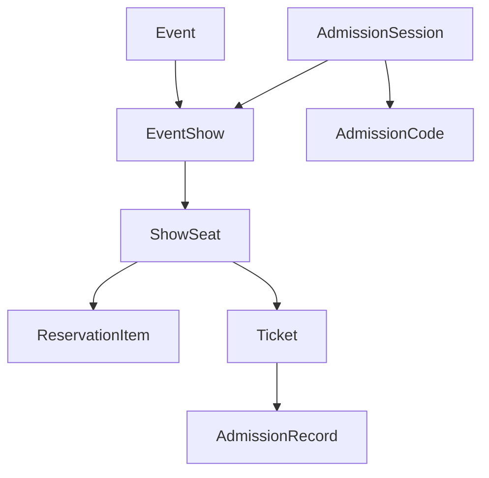

# Multi-Day Multi-Slot Event Plan

## Goals
- Support one event with many show slots (Day 1/Day 2/etc., multiple times per day).
- Make seat inventory and reservations independent per show slot.
- Ensure QR validation only succeeds for the correct show slot.
- Keep legacy events working by auto-migrating existing single `event_start` into one default show slot.

## Current Constraints (validated in code)
- Admin event creation/edit is single datetime via `event_start` in [`/Users/jobsanchez/Documents/Devs/Wish Tickets Portal/WishTicketPortal/components/admin/event-form.tsx`](/Users/jobsanchez/Documents/Devs/Wish Tickets Portal/WishTicketPortal/components/admin/event-form.tsx).
- Availability is event-scoped (`get_event_availability(p_event_id)`) and merges bookings/carts/admin reserves by `event_id` in [`/Users/jobsanchez/Documents/Devs/Wish Tickets Portal/WishTicketPortal/supabase/migrations/00208_get_event_availability_draft_and_published.sql`](/Users/jobsanchez/Documents/Devs/Wish Tickets Portal/WishTicketPortal/supabase/migrations/00208_get_event_availability_draft_and_published.sql).
- Admissions session and scan checks are event-scoped (`AdmissionSessionContext { code, event_id }`) in [`/Users/jobsanchez/Documents/Devs/Wish Tickets Portal/WishTicketPortal/lib/admissions/admission-scan-server.ts`](/Users/jobsanchez/Documents/Devs/Wish Tickets Portal/WishTicketPortal/lib/admissions/admission-scan-server.ts).
- QR format/hash currently excludes show slot (`formatQrData`, `buildEncryptedQrFromQrData`) in [`/Users/jobsanchez/Documents/Devs/Wish Tickets Portal/WishTicketPortal/lib/qr-data.ts`](/Users/jobsanchez/Documents/Devs/Wish Tickets Portal/WishTicketPortal/lib/qr-data.ts).

## Target Model

- Add `event_shows` table for each slot under an event.
- Introduce `show_id` in booking, reservation, ticket, admissions, and print pipelines.
- Add show-scoped seat state (`show_seats`) so the same physical seat can be sold once per slot.
- Scope QR/encrypted payload and admissions session to `show_id`.

## Phase 1: Database Foundation + Backfill
- Create migration to add `event_shows`:
  - `id`, `event_id`, `starts_at`, `ends_at` (nullable), `label` (e.g., "Day 1 - 2:00 PM"), `sort_order`, `status`, timestamps.
  - Unique/indexes: `(event_id, starts_at)`, `(event_id, sort_order)`.
- Backfill existing events: create one default show row from current `events.event_start`.
- Add nullable `show_id` with FK + indexes to:
  - `bookings`, `reservation_carts`, `reservation_items`, `tickets`, `admission_records`, `print_tickets`, `event_admissions_codes`, admin assignment tables if needed.
- Backfill those rows by joining to each event’s default show.
- Add `show_seats` table:
  - `id`, `show_id`, `event_seat_id`, `status` (`available|reserved|hold|sold`), `encrypted_qr`, timestamps.
  - Unique: `(show_id, event_seat_id)`.
- Seed `show_seats` for every `(event_show, event_seat)` pair.

## Phase 2: Availability + Reservation + Checkout
- Replace event-only availability path with show-scoped path:
  - Extend/replace `get_event_availability` to require `p_show_id` and filter bookings/carts/admin reservations by `show_id`.
  - Keep response shape stable to minimize frontend churn.
- Update booking flow files under [`/Users/jobsanchez/Documents/Devs/Wish Tickets Portal/WishTicketPortal/app/[eventSlug]/book`](/Users/jobsanchez/Documents/Devs/Wish Tickets Portal/WishTicketPortal/app/[eventSlug]/book) to carry `showId` through state, queries, and cart sync.
- Update reservation APIs under [`/Users/jobsanchez/Documents/Devs/Wish Tickets Portal/WishTicketPortal/app/api/reservations`](/Users/jobsanchez/Documents/Devs/Wish Tickets Portal/WishTicketPortal/app/api/reservations) to persist `show_id` and lock seats via `show_seats`.
- Update checkout in [`/Users/jobsanchez/Documents/Devs/Wish Tickets Portal/WishTicketPortal/app/api/checkout/route.ts`](/Users/jobsanchez/Documents/Devs/Wish Tickets Portal/WishTicketPortal/app/api/checkout/route.ts):
  - enforce ticket cap per selected show (`ticket_purchase_per_user` now evaluated by `show_id`),
  - create bookings/tickets with `show_id`,
  - update show-seat status transitions.

## Phase 3: QR + Admissions Validation Hardening
- Extend QR payload composition in [`/Users/jobsanchez/Documents/Devs/Wish Tickets Portal/WishTicketPortal/lib/qr-data.ts`](/Users/jobsanchez/Documents/Devs/Wish Tickets Portal/WishTicketPortal/lib/qr-data.ts) to include show identity (slot code or show_id-derived short code).
- Ensure encrypted code generation rotates/scopes by `show_id`.
- Update admissions session model to include `show_id` and require selecting a show slot at login/scan setup.
- Update scan engine in [`/Users/jobsanchez/Documents/Devs/Wish Tickets Portal/WishTicketPortal/lib/admissions/admission-scan-server.ts`](/Users/jobsanchez/Documents/Devs/Wish Tickets Portal/WishTicketPortal/lib/admissions/admission-scan-server.ts):
  - filter ticket lookup by `bookings.show_id`,
  - reject same-event but different-show tickets,
  - write `admission_records.show_id`.
- Update offline pack/sync payloads to include `show_id` and bump pack version to avoid stale cache cross-show admits.

## Phase 4: Admin Event Scheduling UX
- Replace single date/time input in [`/Users/jobsanchez/Documents/Devs/Wish Tickets Portal/WishTicketPortal/components/admin/event-form.tsx`](/Users/jobsanchez/Documents/Devs/Wish Tickets Portal/WishTicketPortal/components/admin/event-form.tsx) with schedule builder:
  - add/remove/reorder show slots,
  - optional bulk generator (e.g., every 2 hours, N occurrences) to match your Day 2 x12-slot use case,
  - validations for overlaps and past times.
- Update admin event APIs under [`/Users/jobsanchez/Documents/Devs/Wish Tickets Portal/WishTicketPortal/app/api/admin/events`](/Users/jobsanchez/Documents/Devs/Wish Tickets Portal/WishTicketPortal/app/api/admin/events) to accept and persist shows array transactionally.
- Keep `events.event_start` as derived field (next upcoming show) for backward-compatible listing/sorting while transitioning RPCs.

## Phase 5: Public Flow + Ticket Artifacts
- Public event page (`/app/[eventSlug]/page.tsx`) adds show-slot selector before booking.
- Cart/checkout/confirmation pages display selected show date/time explicitly.
- Ticket image/email generation (e.g., [`/Users/jobsanchez/Documents/Devs/Wish Tickets Portal/WishTicketPortal/lib/ticket-image.ts`](/Users/jobsanchez/Documents/Devs/Wish Tickets Portal/WishTicketPortal/lib/ticket-image.ts)) uses show datetime, not base event datetime.
- Print-ticket pipeline and resend jobs include `show_id` in generation, filtering, and QR verification.

## Phase 6: Reporting + Admin Operations
- Update dashboard/report queries to support:
  - per-show metrics,
  - event total rollups across shows.
- Update void/release/refund/admin assignment paths to act on selected show only.
- Update duplicate-event RPC migration path to copy `event_shows` and show-scoped state consistently.

## Migration + Rollout Strategy
- Deploy in compatibility order:
  1) schema additions + backfill,
  2) dual-write (`event_id` + `show_id`) in APIs,
  3) read switch to `show_id`,
  4) enforce NOT NULL constraints for `show_id`.
- Add temporary guards in APIs to auto-resolve missing `show_id` to the event’s default show during transition.
- Run shadow verification scripts comparing old event-level availability vs new show-level availability for single-show events.

## Validation/Test Plan
- DB migration tests:
  - all existing events get exactly one default show,
  - all existing bookings/tickets/carts mapped to correct show.
- Booking tests:
  - same seat can be sold in Show A and Show B,
  - same seat cannot double-sell within same show.
- Admissions tests:
  - ticket from Show A fails in Show B scanner session,
  - re-entry behavior remains correct within same show.
- Load tests:
  - availability for high-slot events (e.g., 12 slots/day) remains performant.
- Regression tests:
  - single-show legacy events behave exactly as before.

## Risks and Mitigations
- QR mismatch during rollout: keep dual lookup (`old + new`) temporarily, then remove old after full backfill.
- Query performance impact from `show_id`: add composite indexes early (`(show_id, status)`, `(show_id, seat_id)` etc.).
- Operational confusion in admissions: require explicit show selection and display active show prominently in scanner UI.
- Data drift in dual-write period: add consistency checks in cron/admin diagnostics until cutover complete.
