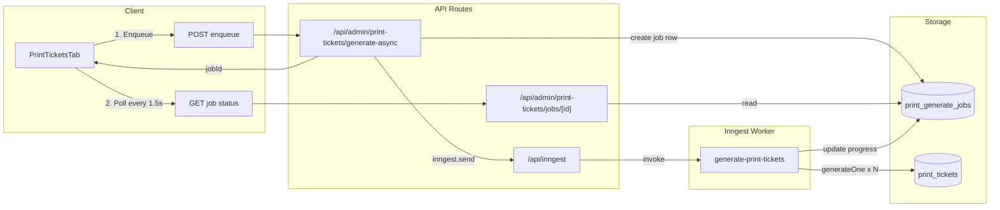

# Print Tickets Job Queue

## Architecture

---

## 1. Supabase: Progress Table

**New migration** `supabase/migrations/00135_print_generate_jobs.sql`:

- `print_generate_jobs` table:
  - `id` (uuid, PK)
  - `event_id` (uuid, FK)
  - `status` (`pending` | `running` | `completed` | `failed`)
  - `total_count` (int) – total tickets to generate
  - `completed_count` (int) – tickets generated so far
  - `error_message` (text, nullable)
  - `created_at`, `updated_at`
  - RLS for staff (same policy pattern as `print_tickets`)

---

## 2. Inngest Setup

**Dependencies:**

- `inngest` (and optionally `@inngest/realtime` – not used initially)

**Files to add/change:**

- [lib/inngest/client.ts](lib/inngest/client.ts) – Inngest client
- [app/api/inngest/route.ts](app/api/inngest/route.ts) – serve Inngest API
- [lib/inngest/functions/generate-print-tickets.ts](lib/inngest/functions/generate-print-tickets.ts) – job function

**Job function logic:**

- Input: `{ jobId, eventId, items: [{ sectionId, seatId? }] }`
- Expand: section with `seatId: null` → all seats in section (or one section-level ticket for free seating)
- Process in batches of ~10 to reduce memory spikes
- After each batch: update `print_generate_jobs.completed_count` and `status`
- Reuse existing `generateOne()` from generate logic (extract to shared lib)
- Use `step.run` only for the overall job; internal loop updates Supabase and yields with `await new Promise(r => setImmediate(r))` periodically
- On error: set `status = 'failed'`, `error_message = err.message`

---

## 3. API Routes

**POST `/api/admin/print-tickets/generate-async`**

- Auth: same as current generate route
- Body: `{ eventId, items: [{ sectionId, seatId? }] }`
- Insert `print_generate_jobs` row (`status: 'pending'`, `total_count` from expanded item count)
- `inngest.send({ name: 'print-tickets/generate', data: { jobId, eventId, items } })`
- Response: `{ jobId }`

**GET `/api/admin/print-tickets/jobs/[id]/route.ts`**

- Auth: same
- Query `print_generate_jobs` by `id`, `event_id` (for scoping)
- Response: `{ status, total_count, completed_count, error_message }`

---

## 4. Client Changes

**[components/admin/print-tickets-tab.tsx](components/admin/print-tickets-tab.tsx)**

- `handleGenerateSelected`:
  1. POST to `/api/admin/print-tickets/generate-async` with `{ eventId, items }` (same shape as current)
  2. Receive `jobId`
  3. Poll `GET /api/admin/print-tickets/jobs/[jobId]` every 1.5s
  4. Update `progress` from `completed_count` / `total_count` and `status`
  5. On `completed` or `failed`: stop polling, `fetchData()`, toast, clear selection and progress
- Existing sync generate route can stay for non-UI callers or be deprecated later.

---

## 5. Extract Shared Generate Logic

**[lib/print-tickets/generate.ts](lib/print-tickets/generate.ts)** (new)

- Move `generateOne()` from [app/api/admin/print-tickets/generate/route.ts](app/api/admin/print-tickets/generate/route.ts) into this lib
- Export `generateOne(supabase, eventId, eventSectionId, eventSeatId)`
- Import from both: existing sync route (kept for now) and Inngest function

---

## 6. Environment and Deployment

- **Env:** `INNGEST_EVENT_KEY` (or signing key) – Inngest dashboard
- **Netlify:** Add [Inngest Netlify integration](https://netlify.com/integrations/inngest) or configure Inngest app to use the deployed `/api/inngest` URL

---

## 7. Sync vs Async

- **Recommended:** All Generate actions go through the async flow
- Small batches (1–5 tickets) still use the queue; job usually finishes in a few seconds and polling provides real progress

---

## Key Files

| File                                                  | Purpose                    |
| ----------------------------------------------------- | -------------------------- |
| `supabase/migrations/00135_print_generate_jobs.sql`   | Job progress table         |
| `lib/inngest/client.ts`                               | Inngest client             |
| `app/api/inngest/route.ts`                            | Inngest HTTP handler       |
| `lib/inngest/functions/generate-print-tickets.ts`     | Background job             |
| `lib/print-tickets/generate.ts`                       | Shared `generateOne` logic |
| `app/api/admin/print-tickets/generate-async/route.ts` | Enqueue endpoint           |
| `app/api/admin/print-tickets/jobs/[id]/route.ts`      | Status polling endpoint    |
| `components/admin/print-tickets-tab.tsx`              | Client: enqueue + poll     |

