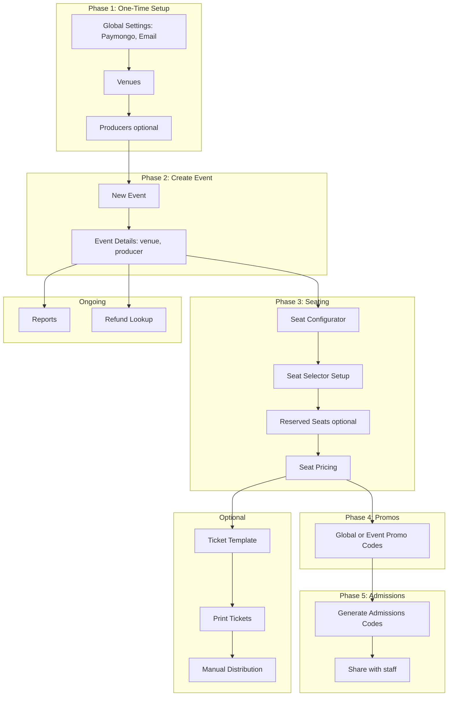

# Admin Operating Instructions for WishTicketPortal

This guide provides step-by-step instructions for admins in the correct sequence. Access the admin area at `/admin` (requires `admin`/`super_admin` role or capabilities such as `manage_events`, `manage_venues`, etc.).

---

## Phase 1: Initial Setup (One-Time)

Do this before creating events.

### 1.1 Global Settings (Super Admin only)

**Path:** Admin Dashboard → **Global Settings** (`/admin/settings`)

| Tab | Purpose |
|-----|---------|
| **Paymongo** | Configure payment gateway (required for checkout) |
| **Email & Tickets** | Email delivery and ticket delivery settings |
| **Events Settings** | Default event categories, featured events |
| **Seat Settings** | Default seating options |
| **Ticket layout** | Global ticket template overlays |
| **Promo Codes** | Create global promo codes (apply to all events) |
| **User Roles** | Assign capabilities to users |

**Order:** Configure **Paymongo** and **Email & Tickets** first so payments and ticket emails work.

### 1.2 Venues

**Path:** Admin Dashboard → **Venues** (`/admin/venues`) → **New venue**

- **Required fields:** Name, Province, City, Standard capacity
- Optional: Google Maps URL
- Venues are required for seating; you cannot configure seats without a venue

### 1.3 Producers (Optional)

**Path:** Admin Dashboard → **Producers** (`/admin/producers`) → **New producer**

- Fields: Name, Representative, Contact, Email
- Producers can be created inline when creating an event

---

## Phase 2: Create a New Event

**Path:** Admin Dashboard → **Events** (`/admin/events`) → **New event** (`/admin/events/new`)

### 2.1 Event Details

| Field | Notes |
|-------|-------|
| Title | Auto-generates URL slug |
| Description | Rich text |
| Category | From Events Settings |
| Status | `draft` (default), `published`, `postponed`, `archived` |
| Image / Thumbnail | Hero and card images |
| Teaser video URL | Optional |
| Event start | Date and time |
| **Venue** | Required for seating; select or create inline |
| **Producer** | Optional; select or create inline |

**Important:** Set **Venue** and **Producer** before proceeding to seating tabs. Without a venue, the Seat Configurator and related tabs will show "Select a venue in Event Details first."

---

## Phase 3: Configure Seating (Per Event)

**Path:** Edit event (`/admin/events/[id]`) → tabs in order below

### 3.1 Seat Configurator

- **Requires:** Venue selected in Event Details
- Create **sections** (e.g., VIP, Orchestra, Balcony)
- For each section:
  - **Seating type:** Assigned (numbered seats), Free (general admission), or Standing
  - **Section code** (e.g., `VIP`, `A`) for display
  - **Color** for seat map
  - For assigned seats: add rows and columns, or use templates
- Upload **seat map images** (optional) for visual reference
- Save changes

### 3.2 Seat Selector Setup

- Configure how the public sees the seat map when booking
- Set which sections show seat selection vs. quantity-only
- Map sections to canvases/backgrounds if using seat map images

### 3.3 Reserved Seats (Optional)

- Reserve specific seats or section quantities (e.g., for sponsors, press)
- Reserved seats are not available for public purchase

### 3.4 Seat Pricing

- Set price per section (or per seat for assigned seating)
- Prices in pesos (stored in centavos)

---

## Phase 4: Promo Codes

### 4.1 Global Promo Codes (All Events)

**Path:** Admin → **Global Settings** → **Promo Codes** tab, or `/admin/promo-codes`

- Apply to all events
- Fields: Code, discount type (percentage/fixed), value, max uses, start/expire dates, active
- Fixed amount: enter pesos (e.g., 50 = ₱50)

### 4.2 Event-Specific Promo Codes

**Path:** Edit event → **Promo Codes** tab

- Apply only to this event
- Same fields as global, plus **stackable** (can combine with other promos)

---

## Phase 5: Admissions (Day-of / Staff)

### 5.1 Generate Admissions Codes

**Path:** Edit event → **Admissions Codes** tab

- Click **Generate** to create a code
- Code is copied to clipboard
- Share this code with admissions staff

### 5.2 Staff Login and Scanning

**Path:** `/admissions/login` (public URL)

1. Staff enters the admissions code
2. On success, redirected to `/admissions/scan`
3. Scan QR codes on tickets or enter codes manually
4. Admit tickets or grant re-entry

**Roles:** `admin`, `super_admin`, or `admissions_staff`

---

## Phase 6: Ticket Template and Print (Optional)

### 6.1 Ticket Template

**Path:** Edit event → **Ticket Template** tab

- Upload a custom ticket image (overrides global layout for this event)
- Used when generating/emailing tickets

### 6.2 Print Tickets

**Path:** Edit event → **Print Tickets** tab

- Generate PDFs for manual distribution
- Send tickets by email (section or selected)

---

## Phase 7: Manual Ticket Distribution

**Path:** Edit event → **Manual Ticket Distribution** link, or `/admin/events/[id]/assign-seats`

- Assign specific seats or section quantities to recipients (name, email)
- Mark as **sales** or **complementary**
- Send tickets by email to recipients (browser-driven batches; large sends use ZIP download links and may split across several emails—keep the tab open until finished)
- Confirm or reverse assignments

**View all assignments:** Admin → **Manual Distribution** (`/admin/ticket-assignments`) — lists tickets by event, recipient, section; can release tickets.

---

## Phase 8: Reports and Refunds

### 8.1 Reports

**Path:** Admin Dashboard → **Reports** (`/admin/reports`)

- Filter by **Producer** and **Event**
- Filter by date range
- KPIs: revenue, occupancy, ticket counts
- Section revenue, payment breakdown, VSS stacked bar
- Auto-refresh option

### 8.2 Refund Lookup

**Path:** Admin Dashboard → **Refund lookup** (`/admin/refund-lookup`)

- Enter **Booking ID** (Invoice # from ticket email)
- Returns PayMongo payment ID(s) needed for processing refunds in PayMongo

---

## Phase 9: Other Admin Tasks

### 9.1 Event Administrators

**Path:** Edit event → **Event Administrators** tab

- Assign users as administrators for this event
- They get event-specific access

### 9.2 Ticket Layout (Global overlays)

**Path:** Admin Dashboard → **Ticket layout** (`/admin/ticket-layout`)

- One overlay layout (QR, event info, section, price, etc.) applies to **all** events
- **Per event:** on Edit event → **Ticket Template**, upload only the **background** PNG for that event (optional); if omitted, the global default background is used

---

## Recommended Sequence Summary

---

## Quick Reference: Admin Paths

| Task | Path |
|------|------|
| Dashboard | `/admin` |
| Events list | `/admin/events` |
| New event | `/admin/events/new` |
| Edit event | `/admin/events/[id]` |
| Assign seats | `/admin/events/[id]/assign-seats` |
| Venues | `/admin/venues` |
| Producers | `/admin/producers` |
| Reports | `/admin/reports` |
| Refund lookup | `/admin/refund-lookup` |
| Global Settings | `/admin/settings` |
| Ticket layout | `/admin/ticket-layout` |
| Manual Distribution | `/admin/ticket-assignments` |
| Promo codes (global) | `/admin/settings` → Promo Codes tab |
| Admissions login | `/admissions/login` |
