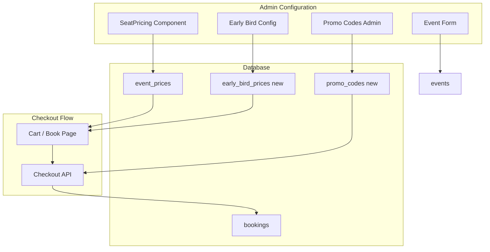

# Ticket Pricing Feature Plan

## Current State

- **Base price:** Already exists. `event_prices` stores `price_cents` per (event_id, section_id). SeatPricing lets admins set prices per section.
- **Flow:** Prices are read in checkout, cart (InlineCart), and book page. `events.event_start` exists and can be used for early bird cutoff.
- **Missing:** Early bird pricing, promo codes, discount types.

---

## Architecture

---

## Phase 1: Base Price (Existing)

No changes. `event_prices` and `SeatPricing` remain as-is.

---

## Phase 2: Early Bird Pricing

**Concept:** Cheaper price if purchased before a cutoff date (e.g. 2 weeks before event).

**Schema (new migration):**

- `early_bird_prices` table:
  - `event_id`, `section_id` (FK to event_sections/sections)
  - `price_cents` (early bird price)
  - `cutoff_at` (timestamptz; after this, regular price applies)
- Optional: add `early_bird_cutoff_at` on `events` if you want one cutoff per event instead of per section.

**Logic:** When resolving price for a section:

- If `now() < cutoff_at` and an early bird row exists → use early bird price
- Else → use `event_prices.price_cents`

**Files to create/update:**

- New migration: `00066_early_bird_pricing.sql`
- API: Extend `/api/events/[id]/prices` to return early bird price + cutoff per section
- Admin: Extend SeatPricing or add an "Early Bird" section with date picker + price per section
- Checkout: Use early bird price when applicable

---

## Phase 3: Promo Codes

**Concept:** Customer enters a code at checkout; discount is applied (percentage or fixed).

**Schema (new migration):**

- `promo_codes` table:
  - `code` (text, unique, case-insensitive)
  - `event_id` (nullable; null = applies to all events)
  - `discount_type` enum: `percentage` | `fixed`
  - `discount_value` (int: percentage 1–100, or cents for fixed)
  - `max_uses` (nullable; null = unlimited)
  - `used_count` (default 0)
  - `starts_at`, `expires_at` (nullable)
  - `active` (boolean, default true)

**Logic:** Validate code (active, event match, within dates, under max_uses), then:

- Percentage: `final = subtotal * (1 - discount_value/100)`
- Fixed: `final = max(0, subtotal - discount_value)`

**Files to create/update:**

- New migration: `00067_promo_codes.sql`
- New API: `POST /api/promo/validate` – body: `{ code, event_id, subtotal_cents }` → returns `{ valid, discount_cents, final_cents, message }`
- Checkout: Accept optional `promo_code`, validate, apply discount, store `promo_code_id` + `discount_cents` on booking
- Bookings: Add `promo_code_id`, `discount_cents` columns
- UI: Checkout page – promo input field, apply button, show discounted total
- Admin: New "Promo Codes" page or section – CRUD for promo codes

---

## Phase 4: Discount Types (Percentage vs Fixed)

Implemented as part of Phase 3 via `promo_codes.discount_type` and `discount_value`:

- `percentage`: `discount_value` 1–100
- `fixed`: `discount_value` in cents

Admin UI and validation ensure correct interpretation per type.

---

## Suggested Implementation Order

| Phase | Scope | Effort |
|-------|-------|--------|
| 1 | Base price (no change) | — |
| 2 | Early bird pricing | Medium |
| 3 | Promo codes + discount types | Medium |

---

## Key Touchpoints

- **Price resolution:** Centralize in a shared function or API so Book page, cart, and checkout use the same rules.
- **Reports:** get_admin_report_tickets uses `bookings.total_cents`; discounted amounts will be reflected if we store `discount_cents` and show breakdown in reports.
- **PayMongo:** Checkout passes `totalCents` to payment link; discounts are applied before that, so no PayMongo changes needed.
